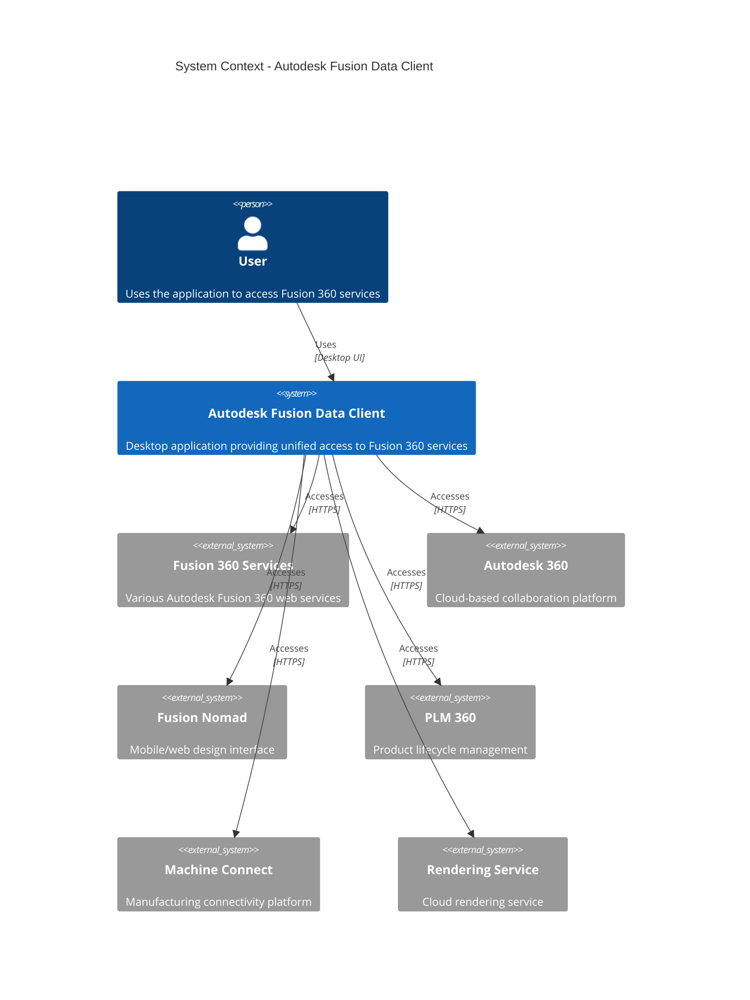
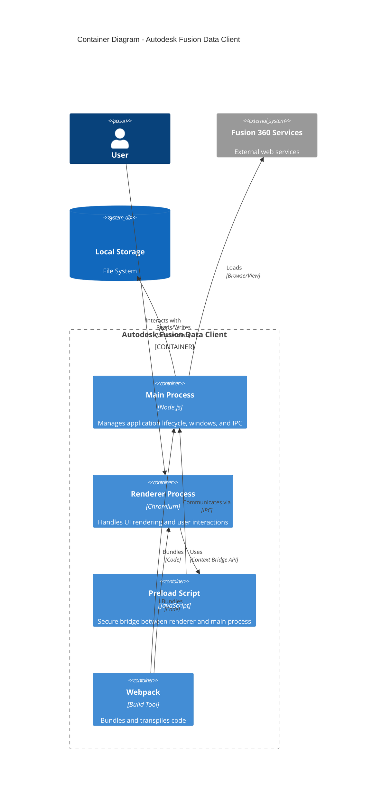
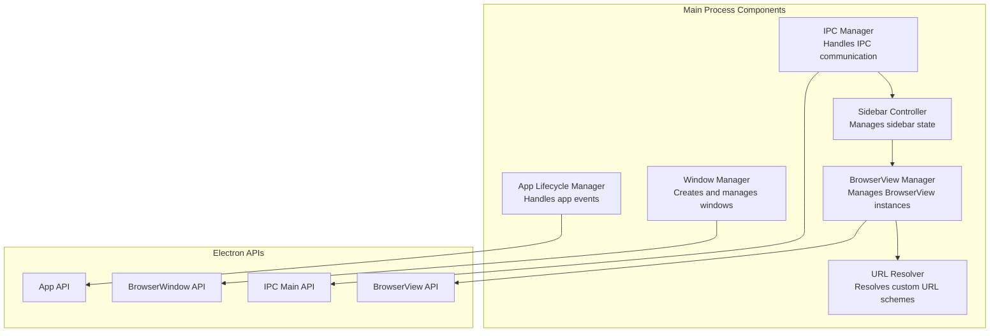
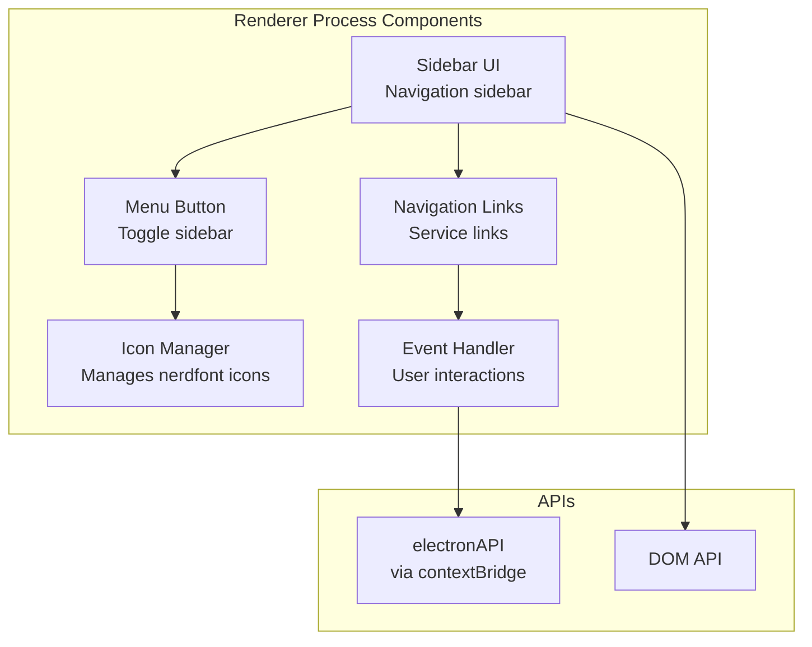
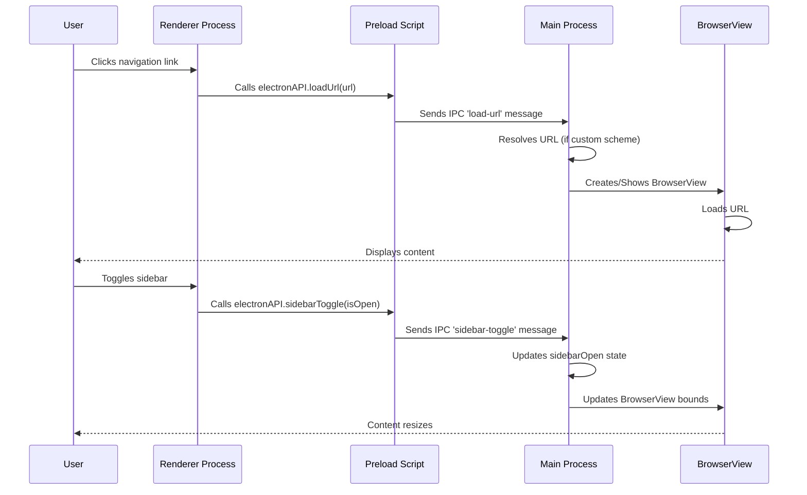
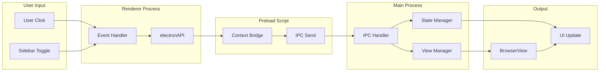
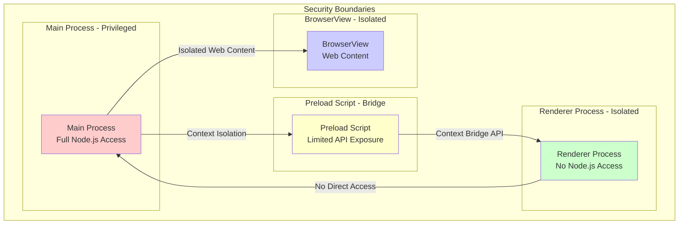

# Architecture Documentation

This document describes the architecture of the Autodesk Fusion Data Client using the C4 model and other architectural diagrams.

## Table of Contents

- [System Context](#system-context)
- [Container Diagram](#container-diagram)
- [Component Diagram](#component-diagram)
- [Process Communication](#process-communication)
- [Data Flow](#data-flow)
- [Security Architecture](#security-architecture)

## System Context

The System Context diagram shows the Autodesk Fusion Data Client and its relationships with external systems and users.

## Container Diagram

The Container diagram shows the high-level technical building blocks of the application.

## Component Diagram - Main Process

This diagram shows the components within the main process.

## Component Diagram - Renderer Process

This diagram shows the components within the renderer process.

## Process Communication

This diagram illustrates how the three Electron processes communicate.

## Data Flow

This diagram shows the flow of data through the application.

## Security Architecture

This diagram shows the security boundaries and isolation mechanisms.

## Architecture Decisions

### 1. Process Separation

**Decision**: Use Electron's multi-process architecture with clear separation between main, renderer, and preload processes.

**Rationale**: 
- Security: Isolates privileged code from web content
- Performance: Separate processes prevent one from blocking others
- Maintainability: Clear boundaries make code easier to understand

### 2. Context Isolation

**Decision**: Enable context isolation and use contextBridge for secure IPC.

**Rationale**:
- Security: Prevents renderer from accessing Node.js APIs directly
- Best Practice: Recommended by Electron security guidelines
- Maintainability: Clear API surface between processes

### 3. BrowserView Management

**Decision**: Use BrowserView instances for each service URL instead of iframes or navigation.

**Rationale**:
- Performance: Better isolation and performance than iframes
- Session Management: Each view can have its own session partition
- User Experience: Seamless switching between services

### 4. Custom URL Schemes

**Decision**: Support custom URL schemes (e.g., `taska://kanban`) for local file access.

**Rationale**:
- Flexibility: Allows local HTML files to be integrated seamlessly
- User Experience: Consistent navigation experience
- Extensibility: Easy to add new local views

### 5. Session Persistence

**Decision**: Use persistent session partition for all BrowserViews.

**Rationale**:
- User Experience: Maintains authentication across all services
- Convenience: Users don't need to re-authenticate
- Security: Session data stored securely by Electron

## Technology Stack

- **Electron**: Desktop application framework
- **Node.js**: Runtime for main process
- **Chromium**: Rendering engine for UI
- **Webpack**: Module bundling and code splitting
- **Jest**: Testing framework
- **Electron Forge**: Build and packaging tool

## Scalability Considerations

- **Memory Management**: BrowserViews are created on-demand and can be destroyed when not in use
- **Performance**: Background throttling disabled for responsive UI
- **Extensibility**: Easy to add new navigation items and services
- **Cross-Platform**: Single codebase supports macOS, Windows, and Linux

## Future Enhancements

- Plugin system for custom integrations
- Offline mode support
- Enhanced caching strategies
- Multi-window support
- Custom themes and branding

